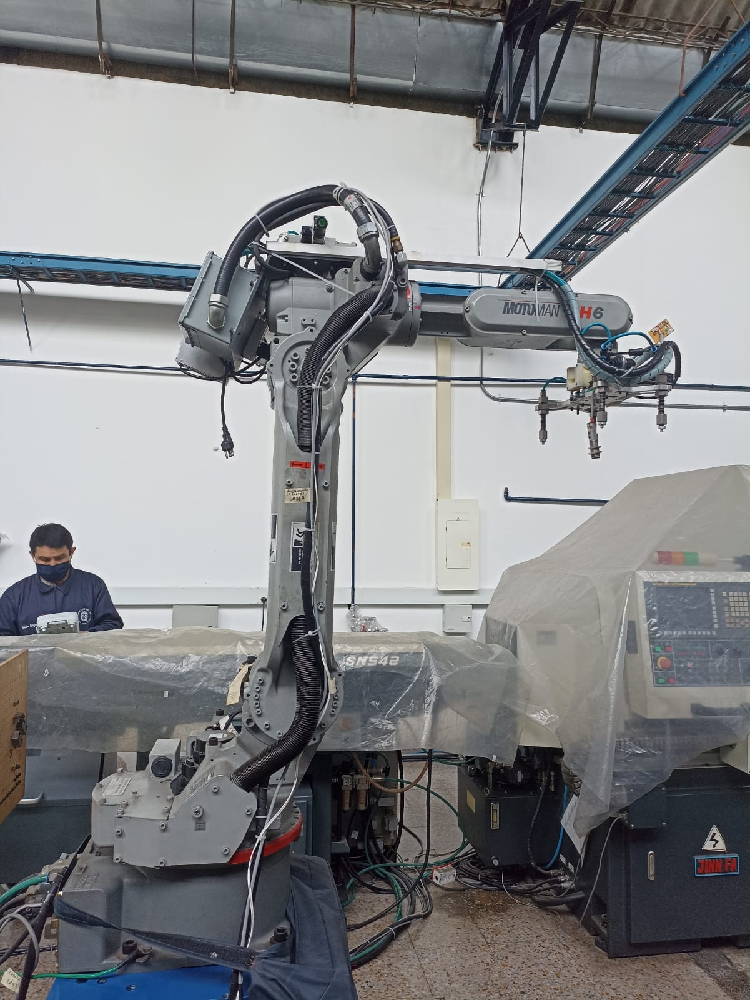
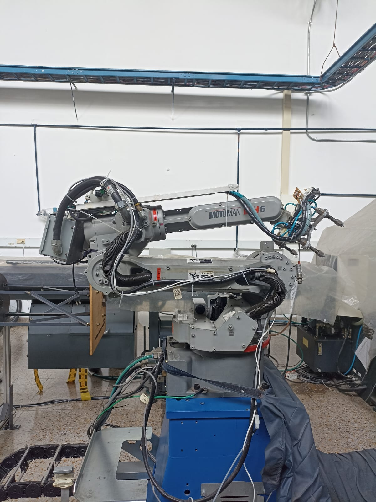
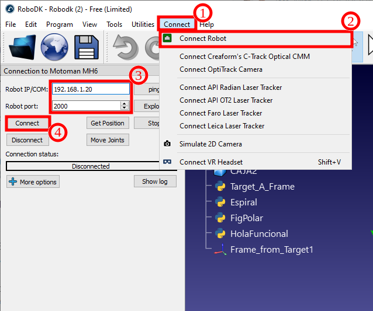

# Laboratorio 2: Análisis y operación del manipulador Motoman MH6: Comparativa y aplicaciones prácticas.

A continuación, se presenta el trabajo realizado para el laboratorio número 2 de la materia Robótica de la Univeridad Nacional de Colombia para el periodo 2024-II.

### Motoman MH6 VS IRB 140
  
|	Característica	|	Motoman MH6	|	IRB 140	|
|	 ---	|	 ---	|	 ---	|
|	Fabricante	|	Yaskawa	|	ABB	|
|	Carga útil máxima	|	6 kg	|	6 kg	|
|	Alcance máximo	|	1,422 mm	|	810 mm	|
|	Repetibilidad	|	±0.08 mm	|	±0.01 mm	|
|	Peso del robot	|	130 kg	|	98 kg	|
|	Número de ejes (Grados de libertad)	|	6	|	6	|
|	Rango de movimiento	|	---	| ---	|
|	Eje 1 (Base S)	|	±170°	|	±165°	|
|	Eje 2 (Brazo inferior L)	|	+155°/-90°	|	+110°/-110°	|
|	Eje 3 (Brazo superior V)	|	+250° /-175°	|	+70° /-160°	|
|	Eje 4 (Muñeca rotación R)	|	±190°	|	±200°	|
|	Eje 5 (Muñeca flexión B)	|	±135°	|	±115°	|
|	Eje 6 (Muñeca giro T)	|	±360°	|	±400°	|
|	Velocidad máxima por eje	| ---	|	---	|
|	Eje 1	|	180°/s	|	150°/s	|
|	Eje 2	|	180°/s	|	120°/s	|
|	Eje 3	|	180°/s	|	140°/s	|
|	Eje 4	|	400°/s	|	280°/s	|
|	Eje 5	|	400°/s	|	280°/s	|
|	Eje 6	|	600°/s	|	280°/s	|
|	Controlador	|	DX100, DX200	|	IRC5 Compact	|
|	Tipo de montaje	|	Piso, pared, techo, invertido	|	Piso, pared, invertido	|
|	Estructura mecánica	|	Brazo articulado	|	Brazo articulado	|
|	Protección ambiental	|	IP54 (cuerpo), IP67 (muñeca)	|	IP67 (cuerpo y muñeca)	|
|	Temperatura de operación	|	0°C - 45°C	|	0°C - 45°C	|
|	Fuente de alimentación	|	200-230V, trifásico	|	200-600V, trifásico	|
|	Consumo de energía	|	Aproximadamente 1.5 kVA	|	Aproximadamente 1.2 kVA	|
|	Compatibilidad con sensores	|	Sí (visión artificial, encoders adicionales)	|	Sí (visión, force control)	|
|	Software de programación	|	MotoSim, RoboDK, INFORM Language	|	RobotStudio, RAPID Language	|
|	Aplicaciones principales	|	Soldadura, manipulación, ensamblaje	|	Ensamblaje, manipulación, soldadura, pick & place	|

### Motoman MH6: Home1 y Home2

Acontinuacion se descipben las posiciones de Home1 y Home2 dispuesta para el manipulador Mmotoman MH6.

  
  
Figura 3. Motoman MH6 Home1.

  
  
Figura 4. Motoman MH6 Home2.

|	Característica	|	Home2 (aprox) | Home2 (real)	|	Home1 (aprox)| Home1 (real)|
|	 ---	|	 ---	|	 ---	|	 ---	|	 ---	|
|	Eje 1 (Base S)	|	0° | 0°	| 0°	|	0°	|
|	Eje 2 (Brazo inferior L)	|	0°	|-1.5665°|	90°	| 88.6629°|
|	Eje 3 (Brazo superior V)	|	0°	|1.7135°|	-83°	| -81.0787° |
|	Eje 4 (Muñeca rotación R)	|	0°	|0° |0°|	-0.0017°	|
|	Eje 5 (Muñeca flexión B)	|	0°	|-0.1468°|	50°	| 51.7618°|
|	Eje 6 (Muñeca giro T)	|	0°	|-3.2709°|	0°	|-3.2709°|

En cuanto a la mejor posocion de home, esta dependera de lo que se quiera realizar. Si se quiere transportar o mover el equipo, la propia empresa recomienda la posicion de Home2 ya que en esta poscion el manipulador ocupara el minimo espacio posible ademas de que su centro de mas se desplaza a la base del bot, lo que facilita su translado. En cuanto a la psocion Home1, es ideal para que un operacion pueda acceder y manipular la herramienta del manipulador, ademas de ser un punto de incio para cualquier rutina ya que parte de que todor los actuadores tienen un giro de 0°.

<ul>  
<li> Procedimiento detallado para realizar movimientos manuales, especificando como cambiar entre modos de operacion (articulaciones, cartesiano) y realizar traslaciones y rotaciones en los ejes X, Y, Z.
<li> Explicacion completa sobre los niveles de velocidad para movimientos manuales, el proceso para cambiar entre niveles y como identificar el nivel establecido en la interfaz del robot.
<li> Descripcion de las principales funcionalidades de RoboDK, explicando como se comunica con el manipulador Motoman y que procesos realiza para ejecutar movimientos.
<li> Analisis comparativo entre RoboDK y RobotStudio, destacando ventajas, limitaciones y aplicaciones de cada herramienta.
<li> Codigo desarrollado en RoboDK para ejecutar una trayectoria polar, adjuntado como anexo dentro del repositorio.
<li> Video de simulacion en RoboDK mostrando la trayectoria polar y evidencia de su implementaci´on en el manipulador Motoman de forma fısica, controlado desde el PC.
</ul>

## Principales funcionalidades de RoboDK

<ul>
<li> Compatibilidad con múltiples marcas: Soporta robots de ABB, KUKA, FANUC, Yaskawa, Universal Robots, entre otros.
<li> Programación offline: Permite generar y simular programas sin necesidad de conectar un robot físico.
<li> Integración con CAD/CAM: Compatible con software como SolidWorks, Fusion 360 y Mastercam para automatización en manufactura.
<li> Lenguajes de programación: Soporta Python, G-code y lenguajes específicos de robots industriales.
<li> Post-procesadores personalizables: Genera códigos específicos para cada marca de robot.
<li> Facilidad de uso: Interfaz intuitiva que simplifica la simulación y programación de robots.
<li> Compatibilidad con visión artificial: Se integra con cámaras y sistemas de inspección visual.
</ul>

## Comunicación de RoboDK con el robot

Para poder correr scripts realizados en un proyecto de RoboDK, se debe hacer click en Connect > Connect Robot. Posteriormente se abrirá una visa en donde se debe colocar la dirección IP de la red del robot y su puerto. Finalmente se debe hacer click en el botón Connect, y cuando la conexión se haya establecido, se mostrará un cuadro verde que mostrara la palabra Ready. Este proceso se ilustra en la figura 5.

  
  
Figura 5. Proceso de conexión de RoboDK con el robot.

## Comparación entre RoboDK y RobotStudio
RoboDK y RobotStudio son dos herramientas potentes de programación fuera de linea y simulación de robots, sin embarbo, cada una responde a necesidades diferentes. RobotStudio está diseñado específicamente para robots ABB, mientras que RoboDK es compatible con múltiples marcas de robots.

| Característica         | RoboDK                          | RobotStudio          |
|------------------------|--------------------------------|----------------------|
| **Fabricante**        | RoboDK (Independiente)         | ABB                  |
| **Compatible con múltiples marcas** | Sí, es compatile con robots ABB, KUKA, FANUC, Yaskawa, UR, entre otros. | No, solo robots ABB  |
| **Facilidad de uso**  | Interfaz intuitiva y fácil de aprender | Más complejo, con herramientas avanzadas |
| **Programación offline** | Sí, para múltiples marcas | Sí, pero solo para ABB |
| **Lenguajes de programación** | Python, G-code, y otros | RAPID (propietario de ABB) |
| **Integración CAD/CAM** | Compatible con SolidWorks, Fusion 360, Mastercam, etc. | Integración limitada con CAD |
| **Precisión de simulación** | Alta precisión para múltiples marcas | Más precisa para robots ABB |
| **Post-Procesadores** | Requiere configuración para cada marca | Preconfigurado para ABB |
| **Precio**           | Pago con prueba gratuita      | Gratuito básico, pago para características avanzadas |
