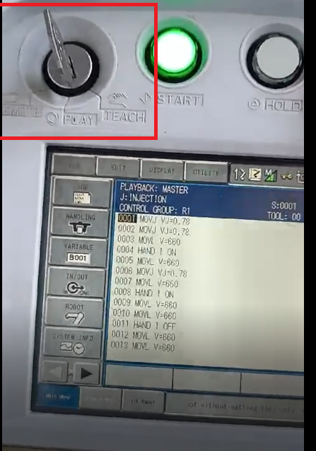
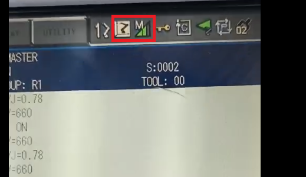
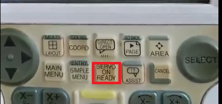

# Laboratorio 2: Análisis y operación del manipulador Motoman MH6: Comparativa y aplicaciones prácticas.

A continuación, se presenta el trabajo realizado para el laboratorio número 2 de la materia Robótica de la Univeridad Nacional de Colombia para el periodo 2024-II.

### Motoman MH6 VS IRB 140
  
|	Característica	|	Motoman MH6	|	IRB 140	|
|	 ---	|	 ---	|	 ---	|
|	Fabricante	|	Yaskawa	|	ABB	|
|	Carga útil máxima	|	6 kg	|	6 kg	|
|	Alcance máximo	|	1,422 mm	|	810 mm	|
|	Repetibilidad	|	±0.08 mm	|	±0.01 mm	|
|	Peso del robot	|	130 kg	|	98 kg	|
|	Número de ejes (Grados de libertad)	|	6	|	6	|
|	Rango de movimiento	|	---	| ---	|
|	Eje 1 (Base S)	|	±170°	|	±165°	|
|	Eje 2 (Brazo inferior L)	|	+155°/-90°	|	+110°/-110°	|
|	Eje 3 (Brazo superior V)	|	+250° /-175°	|	+70° /-160°	|
|	Eje 4 (Muñeca rotación R)	|	±190°	|	±200°	|
|	Eje 5 (Muñeca flexión B)	|	±135°	|	±115°	|
|	Eje 6 (Muñeca giro T)	|	±360°	|	±400°	|
|	Velocidad máxima por eje	| ---	|	---	|
|	Eje 1	|	180°/s	|	150°/s	|
|	Eje 2	|	180°/s	|	120°/s	|
|	Eje 3	|	180°/s	|	140°/s	|
|	Eje 4	|	400°/s	|	280°/s	|
|	Eje 5	|	400°/s	|	280°/s	|
|	Eje 6	|	600°/s	|	280°/s	|
|	Controlador	|	DX100, DX200	|	IRC5 Compact	|
|	Tipo de montaje	|	Piso, pared, techo, invertido	|	Piso, pared, invertido	|
|	Estructura mecánica	|	Brazo articulado	|	Brazo articulado	|
|	Protección ambiental	|	IP54 (cuerpo), IP67 (muñeca)	|	IP67 (cuerpo y muñeca)	|
|	Temperatura de operación	|	0°C - 45°C	|	0°C - 45°C	|
|	Fuente de alimentación	|	200-230V, trifásico	|	200-600V, trifásico	|
|	Consumo de energía	|	Aproximadamente 1.5 kVA	|	Aproximadamente 1.2 kVA	|
|	Compatibilidad con sensores	|	Sí (visión artificial, encoders adicionales)	|	Sí (visión, force control)	|
|	Software de programación	|	MotoSim, RoboDK, INFORM Language	|	RobotStudio, RAPID Language	|
|	Aplicaciones principales	|	Soldadura, manipulación, ensamblaje	|	Ensamblaje, manipulación, soldadura, pick & place	|

### Motoman MH6: Home1 y Home2

En las figuras 3 y 4 se describen las posiciones de Home1 y Home2 dispuestas para el manipulador Motoman MH6.

  
  
Figura 3. Motoman MH6 Home1.

  
  
Figura 4. Motoman MH6 Home2.

|	Característica	|	Home2 (aprox) | Home2 (real)	|	Home1 (aprox)| Home1 (real)|
|	 ---	|	 ---	|	 ---	|	 ---	|	 ---	|
|	Eje 1 (Base S)	|	0° | 0°	| 0°	|	0°	|
|	Eje 2 (Brazo inferior L)	|	0°	|-1.5665°|	90°	| 88.6629°|
|	Eje 3 (Brazo superior V)	|	0°	|1.7135°|	-83°	| -81.0787° |
|	Eje 4 (Muñeca rotación R)	|	0°	|0° |0°|	-0.0017°	|
|	Eje 5 (Muñeca flexión B)	|	0°	|-0.1468°|	50°	| 51.7618°|
|	Eje 6 (Muñeca giro T)	|	0°	|-3.2709°|	0°	|-3.2709°|

En cuanto a la mejor posocion de home, esta dependera de lo que se quiera realizar. Si se quiere transportar o mover el equipo, la propia empresa recomienda la posicion de Home2 ya que en esta poscion el manipulador ocupara el minimo espacio posible ademas de que su centro de mas se desplaza a la base del bot, lo que facilita su translado, ademas de que su posicion, ademas permite acceder y manipular la herramienta del manipulador de forma optima para le operario. En cuanto a la posicion Home1, es ideal para que un operacion de cualquier rutina ya que parte de que todor los actuadores tienen un giro de 0°.

  
  
Figura 5. Recomedacion de transporte Motoman MH6 [1].

## Uso del TeachPendant del Motoman MH6

Procedimiento detallado para realizar movimientos manuales, especificando como cambiar entre modos de operacion (articulaciones, cartesiano) y realizar traslaciones y rotaciones en los ejes X, Y, Z.

En caunto al control manual, este puede realizar de forma local o remota, siendo de forma remota mediante softwares como RoboDK y de froma local mediante el teachpendant de su unidad de control. En primera instacia, en la esquina superior izquierda del Teachpendant esta la llave (ver figura 7) donde se puede seleccionar el modo de operacion del robot sieno estos modos:

<ul>  
<li> Remote: Permite control el Motoman desde equipos remotos.
<li> Play: Corre programas precargados en el Teachpendnat.
<li> Teach: Permite el control manual del Motoman meidnate el Teachpendnat.
</ul>

  
  
Figura 6. TeachPendant Motoman MH6.

  
  
Figura 7. Llave Modo de operacion.

Se selecciona el modo Teach para poder realizar el control manual. En la figura 9, podemos ver resaltados 2 iconos en la esquina superior derecha, estos corresponde al sistema de referencia y la velocidad del Motoman.

  
  
Figura 8. Pantalla TeachPendant Motoman MH6.

  
  
Figura 9. Iconos TeachPendant Motoman MH6.

En primer instancia, elegimos el sistemas de coordenadas con el cual se quiera trabajar. El Motoman nos ofrece los siguientes marcos de referencias:

<ul>  
<li> Joint Coordinates: Se basa en los ángulos individuales de cada articulación del robot, cada eje del robot tiene un valor en grados, y es útil para movimientos punto a punto (PTP) donde se necesita mover cada articulación de forma independiente.
<li> Cartesian Coordinates: Se basa en un sistema X, Y, Z con orientación Rx, Ry, Rz (roll, pitch, yaw), define la posición del centro de la herramienta (TCP) en el espacio 3D, y es util para definir trayectorias rectas o en espacios de trabajo definidos.
<li> Cylindrical Coordinates: Similar a las coordenadas cartesianas, pero usa: R (Radio) como la distancia desde el eje base del robot, θ (Theta) como el angulo de rotación respecto al eje base, y Z como la altura en el eje vertical. Se usa para movimientos en trayectorias circulares.
<li> Tool Coordinates: Define la posición y orientación de la herramienta (TCP) en relación con el flanche del robot y permite programar trayectorias considerando la punta de la herramienta en lugar del flange.
<li> User Coordinates: Permite definir un sistema de coordenadas personalizado en lugar del sistema base del robot.
</ul>

  
  
Figura 10. Sistemas de Coordenadas disponibles y sus iconos.

Para realizar el cambio de sistemas de coordenadas, se hace con el boton Coord (figura 11) el cual esta debajo de la pantalla del Teachpendant. Este se debe presionar de forma constante hasta que el icono que aparezca en pantalla sea el requerido.

  
  
Figura 11. Boton Coord .

En cuanto a la velocidad de movimiento, su icono aparece al lado del de sistema de coordenadas del Teachpendant. El Motoman ofrece la siguienets velocidades:

<ul>  
<li> Inching: Se usa para mover el robot en pequeñas cantidades manualmente. Generalmente, permite movimientos de 0.1° a 1° por pulsación. Es útil para ajustes finos en posiciones críticas.
<li> Low Speed: El robot se mueve a velocidades seguras y controladas, esta en un rango de 1% a 10% de la velocidad máxima.
<li> Medium Speed: Velocidad moderada que permite un balance entre precisión y rapidez. Puede estar en el rango de 10% a 50% de la velocidad máxima.
<li> High Speed: Velocidad máxima del robot dependiendo de la configuración y limitaciones, se usa solo en modo automático (Auto Mode) cuando el robot está en producción. Puede alcanzar hasta 100% de la velocidad programada.
</ul>

  
  
Figura 12. Niveles de velocidad y sus iconos.

Para realizar el cambio de velocidades, se hace con los botones Fast y Slow (figura 13) en la mitad del del Teachpendant. Fast eleva el nivel de velocidad y Slow la disminuye, este cambio se ve reflejado en los iconos de la pantalla.

  
  
Figura 13. Botones Fast/Slow.

Para realizar el movimiento del robot se debe elegir alguno de los sistemas de coordenadas y la velocidad. Ademas, revisar que el boton de emergencia este desactivado y el operario este accionando el boton de hombre muerto en el Teachpendant. Y por ultimo, accionar el boton de Servo On Ready (figura 14), para encender los servomotores del Motoman.

  
  
Figura 14. Boton Servo On Ready.

Independendiente del sistema de coordenadas, el Teachpendant dispone de un juego de botones (figura 15) para el increemento y decremento de cada variable implicada en movimiento del Motoman.

  
  
Figura 15. Controles Movimiento.

En acaso de trabajar moviemiento de articulaciones o Joint Coordinates, cada para de botones correspondara con el movimiento articular de cada servomotor segun la convencion dada por Yaskawa (ver figura 16). En donde, la letra asignada a cada articulacion esta escrita en la parte inferior del boton en letras pequeñas, junto a su respectivo sentido de giro.

  
  
Figura 16. Articulaciones Motoman MH6 [1].

<ul>  

<li> Explicacion completa sobre los niveles de velocidad para movimientos manuales, el proceso para cambiar entre niveles y como identificar el nivel establecido en la interfaz del robot.
</ul>

## Principales funcionalidades de RoboDK

<ul>
<li> Compatibilidad con múltiples marcas: Soporta robots de ABB, KUKA, FANUC, Yaskawa, Universal Robots, entre otros.
<li> Programación offline: Permite generar y simular programas sin necesidad de conectar un robot físico.
<li> Integración con CAD/CAM: Compatible con software como SolidWorks, Fusion 360 y Mastercam para automatización en manufactura.
<li> Lenguajes de programación: Soporta Python, G-code y lenguajes específicos de robots industriales.
<li> Post-procesadores personalizables: Genera códigos específicos para cada marca de robot.
<li> Facilidad de uso: Interfaz intuitiva que simplifica la simulación y programación de robots.
<li> Compatibilidad con visión artificial: Se integra con cámaras y sistemas de inspección visual.
</ul>

## Comunicación de RoboDK con el robot

Para poder correr scripts realizados en un proyecto de RoboDK, se debe hacer click en Connect > Connect Robot. Posteriormente se abrirá una visa en donde se debe colocar la dirección IP de la red del robot y su puerto. Finalmente se debe hacer click en el botón Connect, y cuando la conexión se haya establecido, se mostrará un cuadro verde que mostrara la palabra Ready. Este proceso se ilustra en la figura 5.

  
  
Figura 5. Proceso de conexión de RoboDK con el robot.

## Funciones utilizadas para mover el robot

Para mover el robot mediante código, se utiliza el RoboDK API. Para el caso de Python, se debe importar el sub-módulo robolink del paquete robodk. Este módulo contiene las funciones MoveJ y MoveL, las cuales corresponden al movimiento lineal o movimiento de articulaciones del robot. A ambas se les debe pasar mínimo un target, que puede ser un punto, una pose o una matriz con los valores de las variables de articulación deseados. Para más información se puede consultar la [documentación del paquete robodk](https://robodk.com/doc/en/PythonAPI/robodk.html).

## Comparación entre RoboDK y RobotStudio
RoboDK y RobotStudio son dos herramientas potentes de programación fuera de linea y simulación de robots, sin embargo, cada una responde a necesidades diferentes. RobotStudio está diseñado específicamente para robots ABB, mientras que RoboDK es compatible con múltiples marcas de robots. En el siguiente cuadro comparativo se muestran las diferencias más relevantes entre los dos software.

| Característica         | RoboDK                          | RobotStudio          |
|------------------------|--------------------------------|----------------------|
| **Fabricante**        | RoboDK (Independiente)         | ABB                  |
| **Compatible con múltiples marcas** | Sí, es compatile con robots ABB, KUKA, FANUC, Yaskawa, UR, entre otros. | No, solo robots ABB  |
| **Facilidad de uso**  | Interfaz intuitiva y fácil de aprender | Más complejo, con herramientas avanzadas |
| **Programación offline** | Sí, para múltiples marcas | Sí, pero solo para ABB |
| **Lenguajes de programación** | Python, G-code, y otros | RAPID (propietario de ABB) |
| **Integración CAD/CAM** | Compatible con SolidWorks, Fusion 360, Mastercam, etc. | Integración limitada con CAD |
| **Precisión de simulación** | Alta precisión para múltiples marcas | Más precisa para robots ABB |
| **Post-Procesadores** | Requiere configuración para cada marca | Preconfigurado para ABB |
| **Precio**           | Pago con prueba gratuita      | Gratuito básico, pago para características avanzadas |

## Trayectoria a realizar
La trayectoria que va a seguir el TCP del manipulador, será la curva polar descrita por la ecuación

$r = 1 - \cos{\theta} \sin{3\theta}$

Donde el valor de $\theta$ irá desde $0$ hasta $2 \pi$, para formar la curva de la figura 6.

  
  
Figura 9. Gráfica de la trayectoria polar que realizará el efector final.

## Simulación e implementación en el manipulador

La trayectoria de la curva polar elegida se programó en un script de Python (anexado al repositorio como [FigPolar.py](anexos/FigPolar.py)), se simuló en RoboDK (la simulación se encuentra en el proyecto [LabMotoman.rdk](anexos/LabMotoman.rdk)) y se implemetó en el manipulador real. En el siguiente video se encuentra la simulación y la implementación de la trayectoria.

[link video](https://www.youtube.com/watch?v=hJDKHYDrqE4)
[link video de implementación en tiempo real](https://www.youtube.com/watch?v=aR1bbZq4Tyg) 

# Referencias
[1] Yaskawa. MOTOMAN-MH6 INSTRUCTIONS. 2009. Consultado el 6 de Febrero de 2025. [En linea]: http://www.wtech.com.tw/public/download/manual/yaskawa/YASKAWA%20MH6%20Instructions.pdf

[2] Yaskawa. MotoSim EG-VRC Ver 5.00 OPERATION MANUAL FOR WINDOWS. Consultado el 6 de Febrero de 2025. [En linea]: https://info.ammc.com/hubfs/Partner%20Documents/Yaskawa%20Motoman%20Robots/MotoSim%20VRC%205.0%20Manual.pdf

[3] Yaskawa. Manuel d’instructions REFERENCIA PARA Tabla de instrucciones básicas Programación y reproducción simplificadas Listado de alarmas DX100. Consultado el 6 de Febrero de 2025. [En linea]:https://www.infoplc.net/files/descargas/yaskawa_motoman/infoPLC_net_Programacion_Basica_DX100.pdf

[4] ABB. Especificaciones del producto IRB 140. 2020. Consultado el 6 de Febrero de 2025. [En linea]: https://library.e.abb.com/public/84e6cb203eef4658839e7cf66e8eaf71/3HAC041346%20PS%20IRB%20140-es.pdf?x-sign=ImRvOsT2Jz0WrduLX2Ku7h+p8psQ+kwuvQhn/UcW7RoyrJUh8FyguShi/V3lJkkI

[5] Ricardo E. Ramirez, Dr.-Ing. Pedro F. Cardenas, Ph.D. Programación y Operación Básica Teach Pendant DX 100 Manipulador Motoman MH6. Fundamentos de Robotica industrial. Consultado el 6 de Febrero de 2025.

